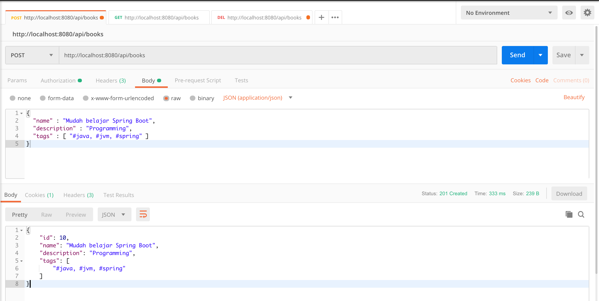
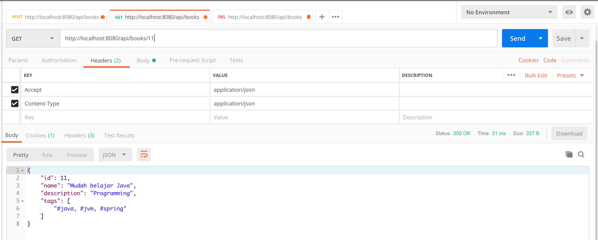

# spring-boot-rest-api-postgresql

#### Plain REST API CRUD with Spring Boot and PostgreSQL.

Technology stack:

* Spring Boot;
* Spring Web;
* Spring Data;
* PostgreSQL database;
* Hibernate;
* Spring Security (as basic authentication).

##### To run this application use:

`mvn clean spring-boot:run`

The view in the Postman:

Add new Book

`POST /api/books`

http://localhost:8080/api/books

Get All Books

`GET /api/books`

http://localhost:8080/api/books

Get Book By Id

`GET /api/books/{id}`

http://localhost:8080/api/books/{id}

Get Book By Name

`GET /api/books?name=name`

http://localhost:8080/api/books?name=name

Delete Book By Id

`DELETE /api/books/{id}`

http://localhost:8080/api/books/{id}

Delete All Books

`DELETE /api/books`

http://localhost:8080/api/books

